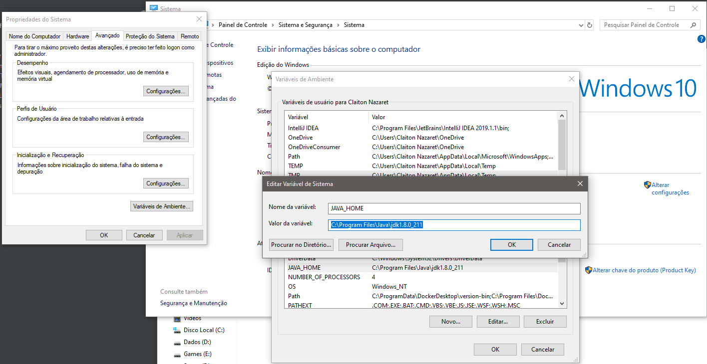
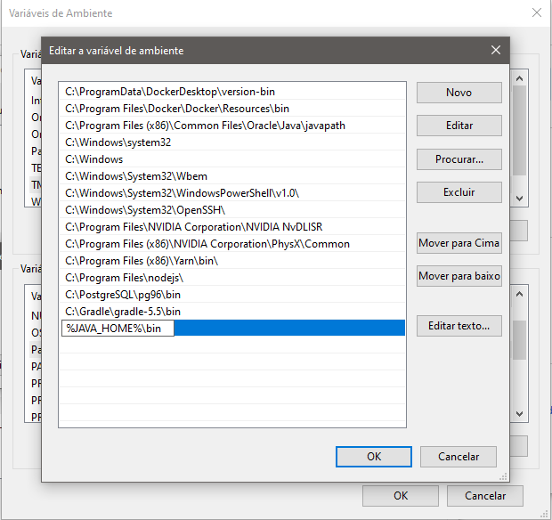

# EyeMobile - Teste Backend-Developer 

## Desafio proposto
Criar uma API Rest que suporte as operações de salvar transações de cartões de débito e crédito com o usuário terminal
 e mostrar todas e apresentar um saldo disponível e à receber com o usuário portal.

## Rodar projeto
- Certifique-se que possua o JDK java v.1.8.0 https://www.oracle.com/technetwork/pt/java/javase/downloads/jdk8-downloads-2133151.html)
- Após instalar o jdk adicione as variáveis de ambiente o JAVA_HOME conforme imagem abaixo 
- Edit a variável path adicionando %JAVA_HOME%\bin conforme imagem abaixo 
- #### Na pasta server execute o comando 
`./gradlew clean bootRun` 

## GET
* GET **/api/portal/list** - Lista todas as transações salvas no banco
* GET **/api/portal/saldo** - Lista o saldo disponivel e a receber de todas transações salvas no banco 

    **usuario:** ``portal``
    **senha:** ``123456``
## POST
* POST **/api/terminal/** - Salva uma transação no banco 

    **usuario:** ``terminal``
    **senha:** ``123456``

## Sobre o desafio
Projeto desenvolvido com muito cuidado e amor em java spring boot, apesar do pouco tempo e disponibilidade.

Utilizei o framework Spring Boot para desenvolver a API, configurar rotas etc. Banco H2 em memória para a agilidade e configuração.
Uma transação inicial já inserida via script sql e gerenciamento de banco liquibase.

Encontrei alguma dificuldade ao converter o campo horário por sua formatação resolvida por um @JsonSerialize estilo Jackson

Criei o arquivo ``documentacao-swagger.yaml`` na raiz do projeto para as requisições e acessos à API

